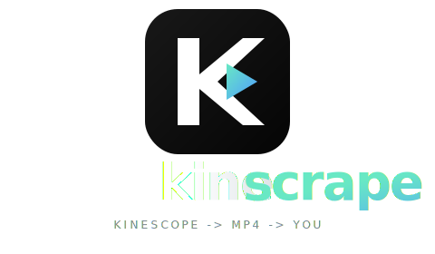

<p align="center">
  
</p>

<p align="center">
  <b>Kinescrape — web app that downloads from Kinescope.</b><br>
  Paste a link. Get an MP4. Nothing touches disk on the server.
</p>

<p align="center">
  <a href="#run-locally">Run locally</a> ·
  <a href="#run-with-docker">Docker</a> ·
  <a href="#api">API</a> ·
  <a href="#cli">CLI</a> ·
  <a href="#how-it-works">How it works</a>
</p>

---

## What it is

Kinescrape is a web app that downloads from Kinescope. Drop in a Kinescope URL, embed snippet, or raw page HTML. It finds the video, fetches the manifest, decrypts ClearKey streams when keys are reachable, muxes audio + video, and streams the MP4 (or a multi-video ZIP) straight back to your browser.

No queue. No upload. No saved files on the server. Output bytes pass through memory and out the response.

## Why it exists

Today you get two flavors of Kinescope downloader. Hosted web apps run on someone else's server: your links sit in their logs, your traffic leaves from their datacenter, and one Kinescope player tweak knocks the whole site offline for everyone. Or raw CLI scripts cobbled from yt-dlp forks and Bash one-liners — fine for geeks, useless for anyone who just wants to paste a link and get an MP4.

Kinescrape is both, on your machine. A clean web UI when you want one, a CLI when you don't, and a small Python core you can read, audit, and patch the next time Kinescope rotates a player.

## Highlights

- **Single MP4** for one link, **streamed ZIP** for many
- **Two muxers**: ffmpeg.wasm in the browser for small clips, native `ffmpeg` on the server for everything else
- **ClearKey decrypt** via Bento4 `mp4decrypt` when the license endpoint is reachable
- **No disk I/O for outputs** — server uses pipes and Linux `memfd` for encrypted segments
- **OpenAPI docs** at `/docs`, schema at `/openapi.json`
- **Hardened Docker** — non-root, read-only rootfs, dropped caps, localhost-only
- **SSRF guard** — blocks private/loopback/link-local upstream URLs and cross-origin API calls
- **CLI** for headless use

## Run locally

```shell
python -m pip install -r requirements.txt
python web_server.py --host 127.0.0.1 --port 8000
```

| | |
|---|---|
| Web app | http://127.0.0.1:8000/ |
| API docs | http://127.0.0.1:8000/docs |
| OpenAPI | http://127.0.0.1:8000/openapi.json |

`ffmpeg` and Bento4 `mp4decrypt` must be on `PATH` for server-side mux/decrypt. Override with `FFMPEG_PATH` / `MP4DECRYPT_PATH`.

## Run with Docker

```shell
docker compose up -d --build
```

Bound to `127.0.0.1:8000`. Logs and teardown:

```shell
docker compose logs -f kinescrape
docker compose down
```

The container runs UID 10001 with a read-only rootfs, all caps dropped, no privilege escalation, isolated bridge network, and tmpfs at `/tmp` and `/run`. Shells, login binaries, and package managers are stripped from the final image.

## How it works

```
browser  ──┐
           │ paste link / embed / HTML
           ▼
     ┌─────────────┐    /api/extract → candidates
     │  FastAPI    │    /api/manifest → DASH/HLS text
     │  web_server │    /api/segment  → byte-range proxy
     └──┬───────┬──┘
        │       │
   wasm mux  native ffmpeg ──► StreamingResponse ──► browser
        │                          (mp4 / zip)
        │
   ClearKey? ──► /api/license → mp4decrypt (memfd) ──► ffmpeg
```

Single videos can be muxed in the browser with `ffmpeg.wasm` (smaller files, zero server CPU). Larger or DRM-protected videos go server-side: segments stream into pipes, `ffmpeg` muxes to `pipe:1`, the response yields chunks as they appear. Multi-link ZIPs use the same pipeline per entry, written into an on-the-fly `ZIP_STORED` archive.

## API

| Method | Path | Purpose |
|---|---|---|
| `GET`  | `/api/health` | health check |
| `POST` | `/api/extract` | find Kinescope video candidates in URL/embed/HTML |
| `POST` | `/api/resolve` | resolve a source down to a single video ID |
| `POST` | `/api/manifest` | proxy a DASH/HLS manifest |
| `POST` | `/api/title` | oEmbed title + thumbnail |
| `POST` | `/api/license` | fetch a ClearKey key |
| `POST` | `/api/segment` | byte-range proxy a single media segment |
| `POST` | `/api/server-mux` | stream one server-muxed MP4 |
| `POST` | `/api/server-zip` | stream a ZIP of server-muxed MP4s |

```shell
curl -X POST http://127.0.0.1:8000/api/extract \
  -H 'Content-Type: application/json' \
  -d '{"source":"https://kinescope.io/VIDEO_ID","referer":""}'
```

Full schemas, request/response examples, and try-it-now console at `/docs`.

## CLI

```shell
python kinescrape.py https://kinescope.io/VIDEO_ID output.mp4
python kinescrape.py --best-quality https://kinescope.io/VIDEO_ID output.mp4
python kinescrape.py --referer https://example.com/course https://kinescope.io/VIDEO_ID output.mp4
```

## Build a binary

```shell
FFMPEG_PATH=/path/to/ffmpeg \
MP4DECRYPT_PATH=/path/to/mp4decrypt \
pyinstaller kinescrape.spec
```

## Project layout

| Path | What lives there |
|---|---|
| `web/` | UI, logo, favicon, ffmpeg.wasm worker glue |
| `web_server.py` | FastAPI app, static host, upstream proxy, server mux, ZIP streaming, ClearKey helpers |
| `kinescrape/` | Kinescope parsing + downloader library |
| `kinescrape.py` | CLI entry |
| `Dockerfile`, `docker-compose.yml` | Hardened local runtime |

## Limits & caveats

- Cross-origin calls to `/api/*` are rejected. Use the bundled UI or call from same origin.
- Upstream URLs resolving to private, loopback, or link-local IPs are refused (SSRF guard).
- ClearKey decrypt requires Linux `memfd_create`. Other platforms can still mux unencrypted streams.
- Use only on videos you are allowed to download.

## License

MIT. See [LICENSE](LICENSE).
